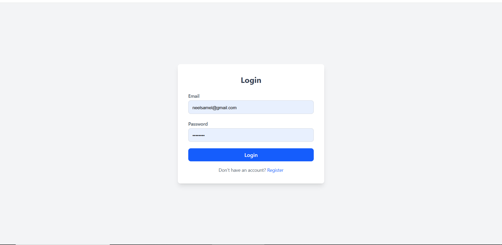
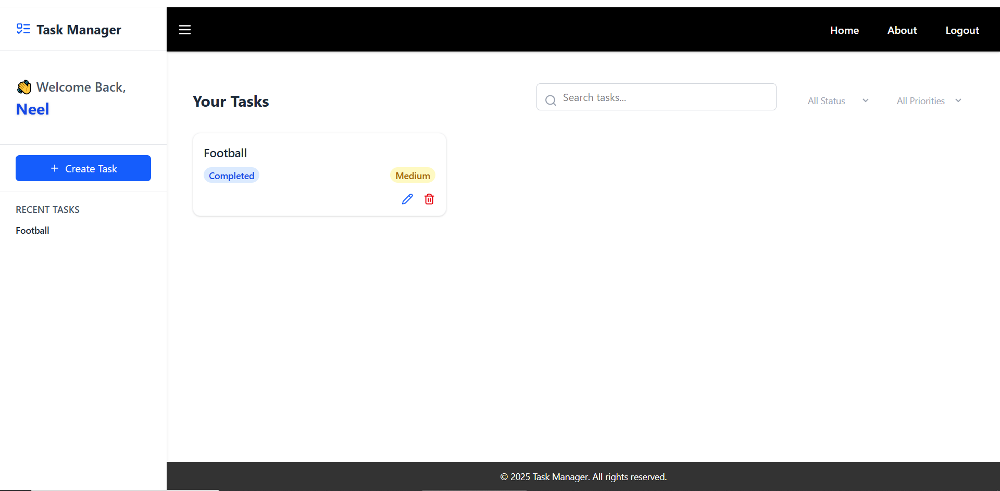

<h1 align="center">📝 Task Manager (MERN Stack)</h1>

<p align="center">
A full-stack <b>Task Manager</b> built with <b>MongoDB, Express.js, React, and Node.js</b>.<br>
Easily register, log in, manage tasks, and track recent activity — all with a clean, responsive UI.
</p>

<p align="center">
  <a href="https://task-manager-mern-flame.vercel.app"></a>
  <a href="https://task-manager-mern-a90b.onrender.com"></a>
</p>

---

## 🚀 Features

### **Frontend**
- 🔐 **User Authentication** — Register, Login, and Logout.
- 🗂 **Task Management** — Create, Edit, Delete, and View tasks.
- 📅 **Recent Tasks** — See the latest added tasks instantly.
- 🔍 **Search & Filters** — Quickly find specific tasks.
- 📱 **Responsive** — Optimized for mobile, tablet, and desktop.
- 🛡 **Protected Routes** — Accessible only to logged-in users.

### **Backend**
- 🗄 **REST API** with Express.js.
- 🛢 **MongoDB** for persistent data storage.
- 🔑 **JWT Authentication** & **bcryptjs** password hashing.
- 🛡 **Middleware-based Authorization**.
- ⚠ **Error Handling Middleware**.

---

## 🛠 Tech Stack

| **Frontend** | **Backend** |
|--------------|-------------|
| React (Hooks & Context API) | Node.js |
| Tailwind CSS | Express.js |
| Axios | MongoDB + Mongoose |
| React Router DOM | JWT Authentication |
|  | bcryptjs, dotenv, cors |

---

## 📂 Folder Structure

```plaintext
TASK_MANAGER_MERN/
│
├── backend/
│   ├── config/          # Database connection
│   ├── controllers/     # Route handlers
│   ├── middleware/      # Auth & error handling
│   ├── models/          # Mongoose schemas
│   ├── routes/          # API routes
│   ├── .env             # Environment variables
│   ├── server.js        # Entry point
│
├── frontend/
│   ├── components/      # Reusable UI
│   ├── context/         # Auth context
│   ├── hooks/           # Custom hooks
│   ├── pages/           # App pages
│   ├── services/        # API calls
│   ├── App.jsx          # Root component
│
└── README.md

⚙ Installation & Setup
1️⃣ Clone the repository
git clone https://github.com/your-username/task-manager-mern.git
cd task-manager-mern

2️⃣ Backend Setup
cd backend
npm install
Create .env in backend/:

PORT=8000
MONGO_URI=your_mongodb_uri
JWT_SECRET=your_secret_key
Run backend:

# Development (auto restart)
npm install --save-dev nodemon
npm run dev

# Production
npm start

3️⃣ Frontend Setup
cd frontend
npm install
Create .env in frontend/:
VITE_API_BASE_URL=https://task-manager-mern-a90b.onrender.com

Run frontend:
npm run dev

🔑 Authentication Flow
Frontend stores token & user in localStorage via AuthContext.
On refresh, token is validated and profile fetched.
Backend uses JWT verification middleware before granting access to protected routes.


## 📸 Screenshots

### 🏠 Dashboard



